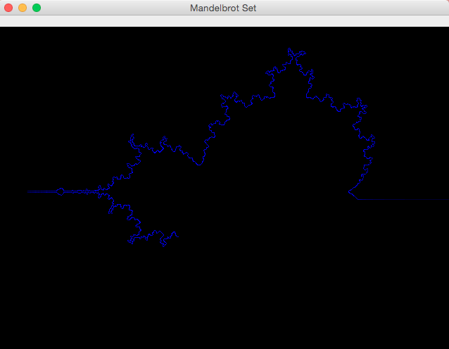

# Lucky Mouses

[](https://github.com/Computer-Kurzweil/turmite/actions/workflows/maven.yml)

**A Group of Mouses following each other.**

## Screenshots

### Running around the Edge of the Mandelbrot Set



### Running around the Edge of the Mandelbrot Set


### Computing the Area outside the Mandelbrot Set


### Repositories
* [Github Repository](https://github.com/Computer-Kurzweil/lucky-mouses)
* [Maven Project Reports](https://java.woehlke.org/lucky-mouses/)

### Run the Application
```
git clone https://github.com/Computer-Kurzweil/lucky-mouses.git
cd lucky-mouses
./mvnw
```
